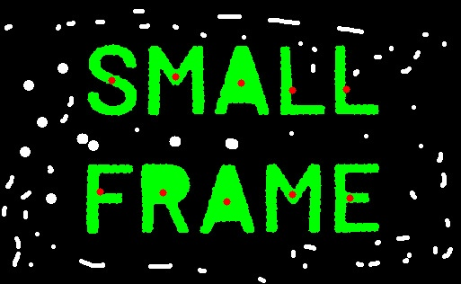

Here's a corrected version of your task description along with the required code.

---

### **Task: Contour Area Filtering (Continuation of Module 8)**

#### **Input Image:**

#### **Objective:**
1. Load the input image and convert it to grayscale.
2. Apply thresholding to segment the letters.
3. Detect the contours of each letter in the image.
4. Compute the **area (in pixels)** for each detected contour.
5. **Filter out contours** that have an area smaller than a predefined threshold.
6. Draw the remaining contours along with their centroids.
7. Save and display the **final processed image** as `filtered.jpg`.

#### **Outpur Image:**

### **Key Features of This Code:**
✔ Converts the image to grayscale for processing.  
✔ Uses binary thresholding to separate the letters.  
✔ Detects contours and filters them based on a set area threshold.  
✔ Draws only the remaining contours along with their centroids.  
✔ Saves the final processed image as `centroids_areas.jpg`.  

Would you like any modifications, such as dynamic area thresholding? 🚀