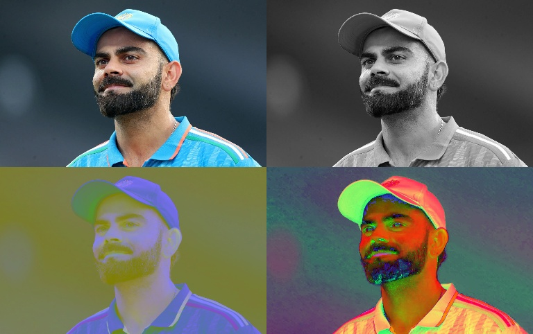

## Task: Understanding and Implementing Image Processing Color Spaces and Resizing

### Objective

This task is designed to help students explore the fundamentals of image processing, including color space conversions, image resizing, and visualization techniques. By the end of the task, students will gain hands-on experience with OpenCV's functions to manipulate images and combine multiple transformations into a single visualization.

---

### What You Will Learn

1. **Loading and Reading Images**  
   - Understand how to load an image using OpenCV's `cv2.imread` function.
   - Learn to handle scenarios where an image might not be loaded correctly (e.g., file not found).

2. **Color Space Conversions**  
   - Convert images between different color spaces:
     - **Grayscale**: Simplifies an image by reducing it to intensity levels.
     - **HSV (Hue, Saturation, Value)**: A color space that separates chromatic content (color) from intensity.
     - **LAB**: A perceptually uniform color space ideal for advanced image processing tasks.

3. **Image Resizing**  
   - Learn how to resize images proportionally using OpenCV's `cv2.resize` function.
   - Understand the importance of consistent dimensions when stacking or combining images.

4. **Image Stacking and Visualization**  
   - Combine multiple processed images into a grid for comparison using NumPy's `hstack` and `vstack`.
   - Display the final result using OpenCV's `cv2.imshow` and save the output with `cv2.imwrite`.

---

### Task Description

You are given an input image (`vk.jpg`). Your task is to:

1. **Read the Image**:  
   - Load the image using OpenCV.
   - Handle errors in case the file path is incorrect.

2. **Perform Color Space Conversions**:  
   - Convert the image into three different formats:
     - Grayscale
     - HSV
     - LAB  

3. **Resize Images**:  
   - Resize the original and processed images to 20% of their original dimensions.

4. **Prepare for Stacking**:  
   - Convert all images to have three channels (BGR format) for consistent visualization.

5. **Stack Images**:  
   - Arrange the images into a 2x2 grid:
     - Top row: Original image and Grayscale image
     - Bottom row: LAB image and HSV image

6. **Display and Save the Result**:  
   - Show the combined image in a window.
   - Save the combined result as `result.jpg`.

---

### Expected Output

