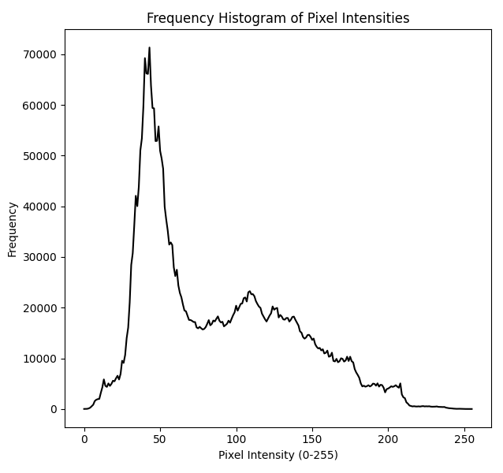

### Image Processing Task: Converting an RGB Image to Grayscale and Analyzing Pixel Intensity Distribution  

#### Objective:  
The purpose of this task is to help students understand the process of converting an RGB image to grayscale and analyzing the distribution of pixel intensities in the grayscale image by plotting a frequency histogram.

---

### Task Description:

Your tasks are as follows:  

1. **Understand Grayscale Conversion:**  
   - Study how an RGB image is converted to grayscale.  
   - Learn about common methods, such as:  
     - **Averaging:** Taking the mean of the R, G, and B components.  
     - **Luminosity Method:** A weighted sum of R, G, and B channels (e.g., \( \text{Gray} = 0.2989 \times R + 0.5870 \times G + 0.1140 \times B \)), which accounts for human perception of brightness.  

2. **Grayscale Image:**  
   - Understand the properties of a grayscale image:  
     - Pixel values range from 0 (black) to 255 (white) in an 8-bit image.  
     - Represents intensity or brightness without color information.  

3. **Frequency Histogram:**  
   - Study what a histogram represents in image processing:  
     - X-axis: Pixel intensity values (0–255).  
     - Y-axis: Frequency of occurrence of each intensity value.  
   - Learn how to interpret a histogram to understand image brightness, contrast, and dynamic range.  

---

### Coding Task:

**Write the Python code to convert an RGB image into grayscale and plot its frequency histogram**
**Output as Follows:**

---

### Deliverables:  
Understand followings:  
1. The theoretical process of converting an RGB image to grayscale.  
2. A grayscale version of the provided RGB image (attach it).  
3. A histogram showing the frequency of pixel intensities in the grayscale image.  
4. An interpretation of the histogram and what it reveals about the image's properties.  

---

### Learning Outcomes:  
By completing this task, students will:  
- Understand the principles and methods of converting RGB images to grayscale.  
- Gain insights into pixel intensity distribution through histograms.  
- Learn to analyze image properties like brightness, contrast, and exposure from a frequency histogram.  