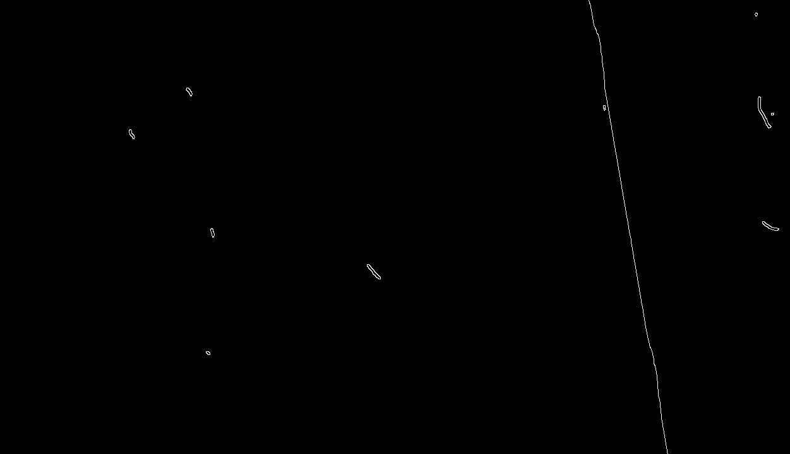

### Edge Detection Task: Understanding and Applying Edge Detection Techniques

#### **Objective**
The goal of this task is to understand and practice the fundamental steps of edge detection in image processing. You will identify and extract edges from an image to highlight object boundaries, textures, or features.

---

#### **Task Description**

1. **Understand the Concept of Edges**:
   - Define what edges are and why they are important in image processing.
   - Discuss how edges correspond to regions of significant intensity change.

2. **Select an Image**:
   - Choose or capture an image to process. Ensure it has clear structures or objects that would benefit from edge detection.
   - Convert the image to grayscale if it is not already in grayscale format.

3. **Noise Reduction**:
   - Apply a smoothing filter (e.g., Gaussian blur) to the image to remove noise. Noise can cause unwanted or false edges, so this step is essential for accuracy.

4. **Choose an Edge Detection Method**:
   - Decide which edge detection algorithm to use (e.g., Sobel, Canny, Prewitt, or Laplacian of Gaussian). Each method has its advantages, and you should justify your choice based on the image and objective.
   
5. **Apply the Edge Detection Algorithm**:
   - Use the selected algorithm to calculate gradients and identify edges in the image.
   - If using a multi-stage method like Canny, ensure you perform each step (gradient calculation, non-maximum suppression, and thresholding) correctly.

6. **Adjust Parameters**:
   - Experiment with thresholds, kernel sizes, or smoothing parameters to refine the edge detection results. Document how these changes affect the output.

7. **Visualize the Results**:
   - Display the original image and the edge-detected image side by side for comparison.
   - Analyze the detected edges to see if they align with the boundaries and features in the original image.

8. **Evaluate the Performance**:
   - Discuss the quality of the detected edges. Are they sharp and clear? Are there any false edges or missing edges?
   - Suggest improvements or alternative methods if the results are not satisfactory.
   
9. **Task Output**:

---

#### **Deliverables**
1. A written explanation of the chosen edge detection method and its advantages.
2. A visualization of the original image alongside the edge-detected image.
3. An analysis of the results, including observations about the clarity and accuracy of the edges.
4. A brief reflection on parameter tuning and its impact on the output.

---

#### **Key Considerations**
- Ensure the edges you detect correspond to meaningful features in the image (e.g., object boundaries).
- Avoid over-smoothing, as it may remove important details along with noise.
- Use appropriate thresholds to balance between detecting all edges and avoiding false positives.

By completing this task, you will gain hands-on experience with edge detection and better understand its applications in real-world scenarios like object recognition, image segmentation, and computer vision.