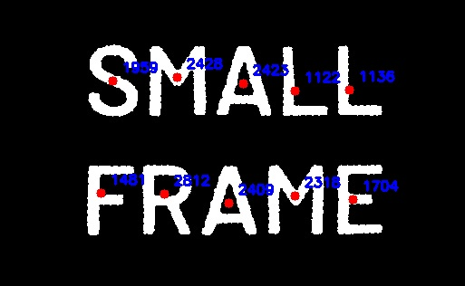

### **Task: Contour Area Calculation (Continuation of Module 8)**

You are given an image containing multiple letters.

#### **Input Image:**
📌 

#### **Objective:**
1. Detect the contours of each letter in the image.
2. Calculate the **centroid (center of mass)** of each detected contour.
3. **Mark the detected centroids** on the image with a red dot.
4. Compute the **area (pixel area)** of each contour.
5. **Display the area** near the centroid in the output image.
6. Save and display the **final processed image** with centroids and areas.

#### **Expected Output Image:**
📌  
- Each detected letter should have a **red dot** at its centroid.
- The **area value** should be displayed next to the centroid in **blue text**.

